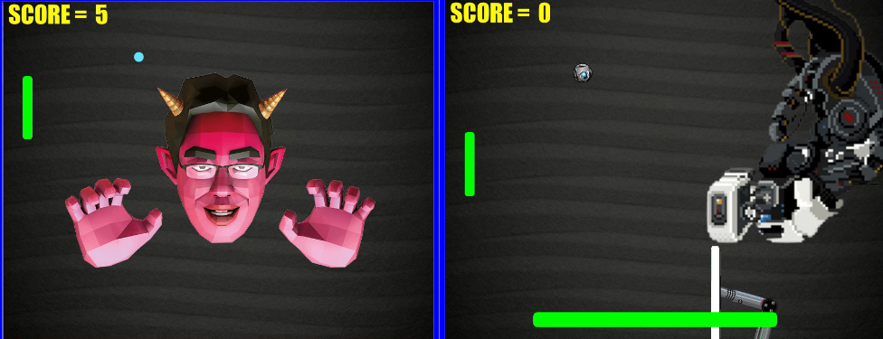
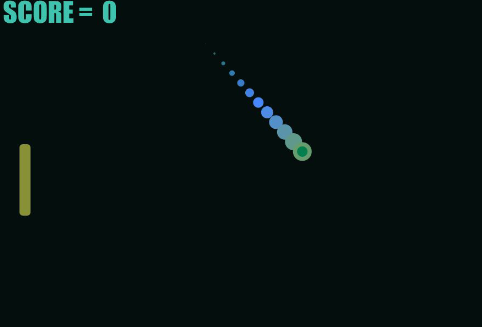
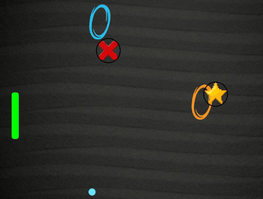
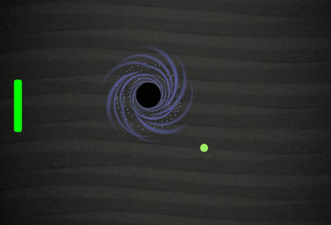

# Ultimate-Pong-Game

## Images du jeu

## Comment lancer le jeu ?

**==== Sans Processing ====**
- téléchargez le fichier en .zip (voici un second lien de téléchargement direct:
*https://github.com/Pholith/Ultimate-Pong-Game/archive/master.zip* )
- décompressez le / extraiyez le
- ouvrez le et cliquez sur "Ultimate_Pong_Game.exe - Raccourci" OU ouvrez le directement à cet emplacement: Ultimate-Pong-Game-master\Ultimate-Pong-Game-master\Ultimate-Pong-Game\Ultimate_Pong_Game\application.windows64\

**==== Avec Processing ====**
- téléchargez le fichier en .zip (voici un second lien de téléchargement direct:
*https://github.com/Pholith/Ultimate-Pong-Game/archive/master.zip* )
- décompressez le / extraiyez le
- ouvrez le et cliquez sur "Ultimate_Pong_Game.pyde" (avec le logo de Processing)
- installez la librairie minim depuis processing (ajouter un outil/librairie/minim)
- cliquez sur le bouton play en haut à gauche 

Dans le menu des options:
clic gauche pour cocher une case
clic droit pour décocher une cas
